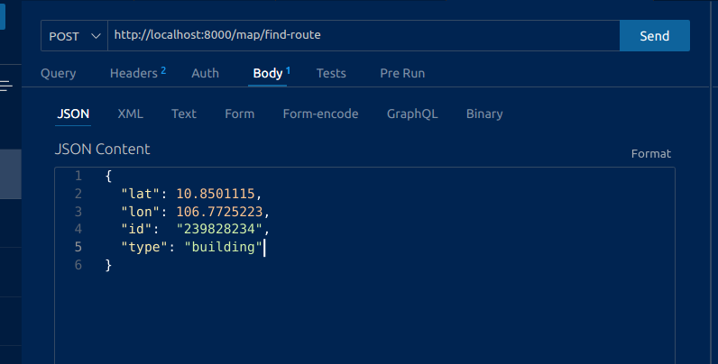

## Đồ án cuối kì môn học Trí Tuệ Nhân Tạo

- Ứng dụng thuật toán BFS và GreedyBest First Search vào trong AI lập thời gian học tập cho 1 tuần làm việc

# 1. Backend

Dẫn tới thư mục chứa backend,

`cd backend`

Tạo môi trường ảo
`python3 -m venv venv`

Kích hoạt môi trường ảo
Linux: `source venv/bin/active`
Windows: `venv\Scripts\activate`

Cài đặt các gói thư viện của python
`pip install -r requirements.txt`

Khởi chạy backend
`uvicorn main:app --reload`

Thầy có thể dùng đường link này để test sau khi chạy backend: `localhost:8000/docs`

Sample request:

```
    {
        "lat": 10.8501115,
        "lon": 106.7725223,
        "id":  "239828234",
        "type": "building"
    }
```


